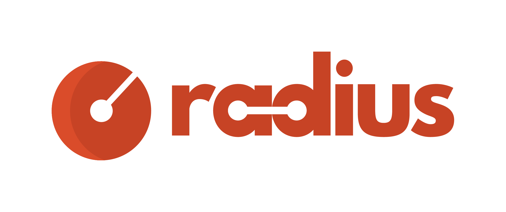

# Radius Community

Welcome to the Radius community. This is the starting point for becoming a contributor to improve the code and docs, giving presentations, and general community engagement for the project. We are looking forward to working together, thank you for your involvement and contributions to Radius!

- [Introduction](#introduction)
- [Radius authors](#radius-authors)
- [Communication and Discord](#communication-and-discord)
    - [Questions and issues](#questions-and-issues)
- [Community meetings](#community-meetings)
    - [Upcoming calls](#upcoming-calls)
    - [Previous calls](#previous-calls)

## Introduction

Radius is a platform for developers and IT operators building cloud-native applications. With Radius, teams can model, deploy, manage, and troubleshoot entire applications across on-premises and multi-cloud environments, with a consistent set of tools and a common experience across it all.

As the pace of innovation increases for cloud-native technologies, so does the need for rapid progress within application teams. Application teams need a platform that can let developers and operators work together, while still maintaining the agility their users and applications require. These are the challenges that Radius is designed to solve.

Visit [radapp.io](https://radapp.io/) for information about Radius.

## Radius authors

Radius is an open source project with an active development community.

## Communication and Discord

All your contributions and suggestions are greatly appreciated! One of the easiest ways to contribute is to participate in Discord discussions, report issues, or join the monthly community calls.

### Questions and issues

Reach out with any questions you may have and we'll make sure to answer them as soon as possible. Community members, please feel free to jump in to join discussions or answer questions!

| Platform  | Link        |
|:----------|:------------|
| 💬 Discord (preferred) | Join the [Discord server](https://aka.ms/radius/discord)

### Email announcements

Want to stay up to date with Radius releases, community calls, and other announcements? Join the [radapp_io](https://groups.google.com/g/radapp_io) Google Group to stay up to date on the latest Radius news. You can join and customize your notification preferences. Average email volume is 1-2 emails a month.

| Group | Link |
|:------|:-----|
| 📧 radapp_io | Join the [radapp_io Group](https://groups.google.com/g/radapp_io)

## Community meetings

### Community Calls

Every month we host a community call to showcase new features, review upcoming milestones, and engage in a Q&A. For community calls, anyone from the Radius community can participate, present a topic, or host. All are welcome!

Issues in the community repo are used to suggest topics for an upcoming Radius community call. Upcoming community meetings are pinned as issues in this repository. If you would like to present or discuss something during an upcoming community meeting, please propose the topic and add a comment to the issue corresponding to the desired meeting occurrence. Alternatively, you may use Discord to propose future agenda topics. The meeting agenda for each call is finalized by the community call host.

Community members (members of the Radius GitHub org) can nominate themselves via an issue in the `radius-project/community` repository to be a community call host. Members become approved community call hosts when two or more existing community hosts approve their request, similar to how members and approvers get accepted today.

You can always catch up offline by watching the recordings below.

| Asset | Link        |
|:-----------|:------------|
| 🔗 Meeting Link | https://aka.ms/radius/community-call
| 🎥 Meeting Recordings | [YouTube](https://www.youtube.com/playlist?list=PLrZ6kld_pvgwYMLI-j_f0Dq2Dgv5MlK8R)

#### Upcoming calls

Use the upcoming calendar events below to add the community call events to your calendar.

| Date & time | Agenda |
|-------------|--------|
| Thursday Feb 22nd, 2024 9:00am Pacific Time (PST) [_See it in your local time and add to your calendar_](https://www.timeanddate.com/worldclock/fixedtime.html?iso=20240222T09&p1=234&msg=Radius+Community+Call) | radius-project/community#21

#### Previous calls

| Date & time | Agenda |
|-------------|--------|
| [Thursday Jan 25th, 2024 9:00am Pacific Time (PST)](https://youtu.be/JDYmY1IRVOs?si=RGp6G_WlubeP_6iH) | radius-project/community#19
| [Thursday Nov 30th, 2023 9:00am Pacific Time (PST)](https://youtu.be/DtZnb-uD84I)] | radius-project/community#15
| [Thursday Nov 2nd, 2023 9:00am Pacific Time (PST)](https://youtu.be/EfGAwli5W4U?si=FqSq_nt1bKrtNDm2) | radius-project/community#7

<!--
!!!REMINDER!!!

When adding new scheduled meetings to this list:
* make sure to update the URL for each entry too. The `iso` param should be updated following the `YYYYMMDD` format.
* make sure the suffix is correct for the numeral: `st`, `nd`, `th` so it reads right like `22nd` and not `22th`
-->

### Office Hours 

In addition to the community calls, we want to engage with the community 1:1 via Office hour sessions to help them get started with Radius. The Radius core team will be available between 9:30 AM - 10:00 AM PST on Wednesdays to help answer questions. Office hours are designed for ALL and are not limited to those who commit source code. This is a great opportunity to ask questions, share feedback, or discuss anything related to Radius.

| Asset | Link        |
|:-----------|:------------|
| 🔗 Booking Invite | [https://aka.ms/radius/community-call](https://aka.ms/radius-office-hours)

## Radius blog

The [Radius blog](https://blog.radapp.io/posts) has regular posts on releases, technical articles and upcoming events. If you would like to author a post, reach out to us with a suggestion. 

<!-- ## Community membership
There are various contributor roles in the Radius community that you are strongly encouraged to be part of. Read [Community membership](community-membership.md)
for more information. -->

<!-- add role definitions going forward (e.g. steering committee, administrator, managers, etc.) -->
<!-- ## Roles

There are a several different roles that are available in the community. -->

## How can I get involved?

One of the easiest ways to contribute is to participate in discussions at community engagements or write a blog entry.

If you're looking for something to work on, read the [contribution guidelines](https://docs.radapp.io/community/contributing/overview/) and then you start by looking for GitHub issues, marked with `good first issue` or the `help wanted` labels:

- [Radius repo](https://github.com/radius-project/radius/labels/good%20first%20issue)
- [Documentation repo](https://github.com/radius-project/docs/labels/good%20first%20issue)
- [Recipes repo](https://github.com/radius-project/recipes/labels/good%20first%20issue)
- [Samples repo](https://github.com/radius-project/samples/labels/good%20first%20issue)

And, we can always use more testing, have more and improved docs, or just write a blog post on what you have discovered whilst using Radius.

If you're a developer, read the [development guide](https://github.com/radius-project/radius/tree/main/docs) for help on how to get started.

## Code of Conduct

This project has adopted the [Contributor Covenant Code of Conduct](CODE-OF-CONDUCT.md)
